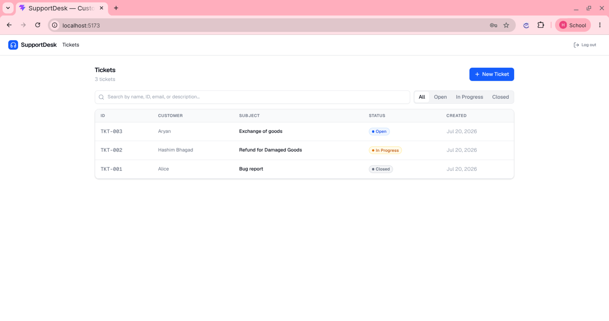
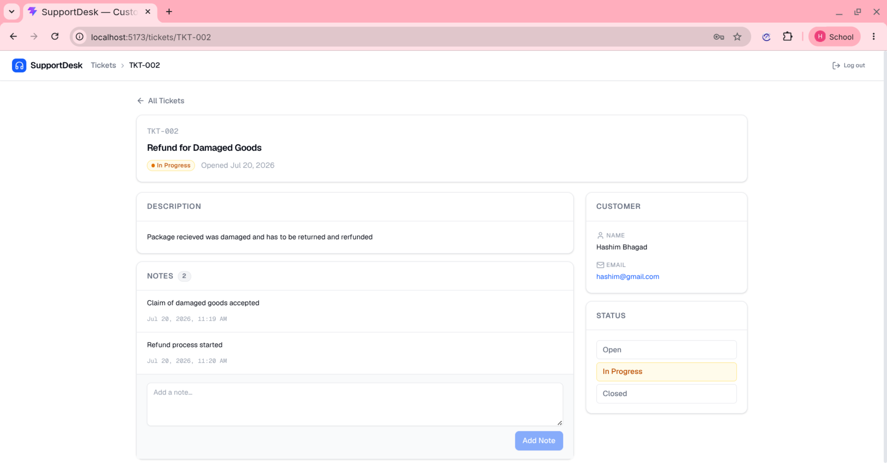
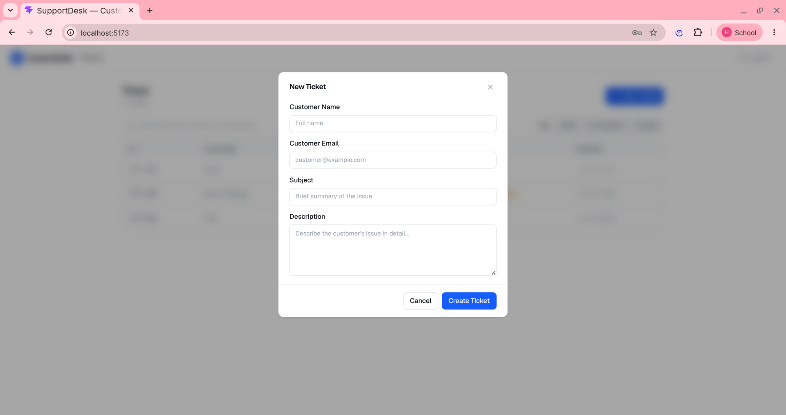
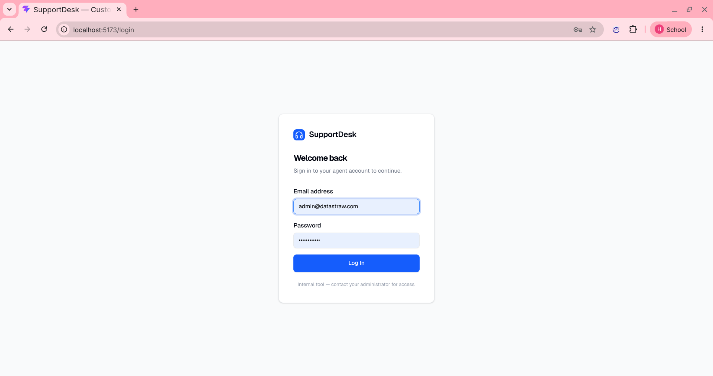

# SupportDesk — Customer Support CRM

A full-stack customer support ticketing system for managing customer inquiries. Create, track, and update support tickets with a clean agent-facing interface.

---

## Screenshots

| | |
|---|---|
|  |  |
|  |  |

---

## Tech Stack

| Layer | Technology | Purpose |
|---|---|---|
| **Backend** | Python 3.11, FastAPI | REST API with auto-generated OpenAPI docs |
| **Database** | SQLite via SQLAlchemy 2.0 ORM | Relational data, zero-config |
| **Auth** | JWT (python-jose) + bcrypt (passlib) | Stateless token-based authentication |
| **Frontend** | React 19, Vite, Tailwind CSS 4 | SPA with fast dev loop |
| **Icons** | Lucide React | Consistent icon set |
| **API Client** | Axios | HTTP client with JWT interceptor |
| **Package mgmt** | uv (backend) / npm (frontend) | Lockfile-pinned dependencies |

---

## Architecture

```
┌────────────┐     JWT (Bearer)      ┌──────────────┐     ┌──────────┐
│  Frontend  │ ──────────────────→   │   FastAPI    │ ──→ │  SQLite  │
│  (Vite +   │ ←──────────────────   │   Backend    │ ←── │   (DB)   │
│   React)   │     JSON + 401s       │   :8000      │     │          │
└────────────┘                       └──────────────┘     └──────────┘
     │                                    │
     ├─ Public: Login                     ├─ POST /api/auth/login
     ├─ Protected: Ticket list            ├─ GET/POST /api/tickets
     ├─ Protected: Ticket detail          ├─ GET/PUT /api/tickets/{id}
     └─ 401 → redirect /login             └─ All protected by JWT
```

### Backend

FastAPI application with four layers:

- **Routers** — `routers/auth.py` (login) and `routers/tickets.py` (CRUD endpoints)
- **Dependencies** — `security.py` provides JWT creation/verification and the `get_current_user` dependency injected into every protected route
- **Models** — `models.py` defines SQLAlchemy ORM models (`User`, `Ticket`, `Note`)
- **Schemas** — `schemas.py` defines Pydantic models for request validation and response serialization

On startup, the app creates database tables and seeds a default admin user (credentials from environment variables).

### Frontend

React single-page application with:

- **Public route** — `/login` renders a sign-in form
- **Protected routes** — `/` (ticket list) and `/tickets/:ticketId` (ticket detail)
- **Auth flow** — JWT stored in `localStorage`, attached via Axios interceptor, cleared with redirect on 401
- **UI components** — Tailwind-styled, Lucide icons, skeleton loading states, toast notifications

### Auth Flow

```
Login Form ──→ POST /api/auth/login ──→ JWT ──→ localStorage
                                                    │
Request ──→ Axios interceptor ──→ Authorization: Bearer <JWT> ──→ FastAPI get_current_user ──→ endpoint
                                                    │
                                             401 response
                                                    │
                                              Clear token
                                                    │
                                         Redirect to /login
```

---

## Project Structure

```
support-crm/
├── backend/
│   ├── app/
│   │   ├── main.py           # App instance, CORS, startup
│   │   ├── database.py       # SQLAlchemy engine + session
│   │   ├── models.py         # User, Ticket, Note ORM models
│   │   ├── schemas.py        # Pydantic request/response schemas
│   │   ├── security.py       # Password hashing, JWT, auth dependency
│   │   ├── config.py         # Environment config via pydantic-settings
│   │   └── routers/
│   │       ├── auth.py       # POST /api/auth/login
│   │       └── tickets.py    # Ticket CRUD endpoints
│   ├── .env.example
│   ├── pyproject.toml
│   └── uv.lock
│
├── frontend/
│   ├── src/
│   │   ├── App.jsx           # Router config
│   │   ├── api.js            # Axios instance with JWT interceptor
│   │   ├── context/
│   │   │   └── AuthContext.jsx
│   │   ├── pages/
│   │   │   ├── LoginPage.jsx
│   │   │   ├── TicketListPage.jsx
│   │   │   └── TicketDetailPage.jsx
│   │   └── components/
│   │       ├── TopBar.jsx
│   │       ├── CreateTicketModal.jsx
│   │       ├── StatusBadge.jsx
│   │       ├── SkeletonRows.jsx
│   │       ├── Toast.jsx
│   │       └── ui/           # Reusable primitives
│   ├── .env.example
│   ├── package.json
│   └── package-lock.json
│
├── .gitignore
└── README.md
```

---

## API Reference

| Method | Route | Auth | Description |
|---|---|---|---|
| POST | `/api/auth/login` | No | Log in, returns JWT |
| POST | `/api/tickets` | Yes | Create a new ticket |
| GET | `/api/tickets` | Yes | List tickets (optional `?status=` and `?search=` query params) |
| GET | `/api/tickets/{ticket_id}` | Yes | Get ticket detail with notes |
| PUT | `/api/tickets/{ticket_id}` | Yes | Update status or add a note |

All protected endpoints return **401** when the JWT is missing, expired, or invalid.

---

## Setup

### Prerequisites

- Python 3.11+
- Node.js 20+
- [uv](https://docs.astral.sh/uv/) (Python package manager)

### 1. Clone the repository

```bash
git clone https://github.com/Hashim-Bhagad/Support-CRM.git
cd support-crm
```

### 2. Backend setup

```bash
cd backend

# Create environment file
cp .env.example .env
# Edit .env with your values (SECRET_KEY, ADMIN_EMAIL, ADMIN_PASSWORD)

# Create virtual environment and install dependencies
uv sync

# Activate the virtual environment
source .venv/bin/activate

# Start the server
uv run uvicorn app.main:app --port 8000 --reload
```

The backend starts at `http://localhost:8000`. API docs are available at `http://localhost:8000/docs`.

**Default admin credentials** (set in `.env`):
- Email: `admin@company.com` (or whatever you configured)
- Password: the value of `ADMIN_PASSWORD` in your `.env`

### 3. Frontend setup

```bash
cd frontend

# Create environment file
cp .env.example .env

# Install dependencies
npm install

# Start the dev server
npm run dev
```

The frontend starts at `http://localhost:5173`. The Vite dev server proxies `/api` requests to `http://localhost:8000`.

---

## Environment Variables

### backend/.env

| Variable | Description | Default |
|---|---|---|
| `SECRET_KEY` | JWT signing key (generate a random string) | — |
| `DATABASE_URL` | SQLite database path | `sqlite:///./crm.db` |
| `ADMIN_EMAIL` | Seeded admin user email | `admin@company.com` |
| `ADMIN_PASSWORD` | Seeded admin user password | — |
| `ALGORITHM` | JWT signing algorithm | `HS256` |

### frontend/.env

| Variable | Description |
|---|---|
| `VITE_API_BASE_URL` | Backend API URL (leave empty in dev to use Vite proxy) |

---

## Features

- **Ticket management** — Create, list, view, and update support tickets
- **Search & filter** — Search across name, email, ID, subject, and description; filter by status (Open / In Progress / Closed)
- **Status tracking** — Change ticket status with one click
- **Notes** — Add chronological notes to any ticket
- **Authentication** — JWT-based login with bcrypt password hashing
- **Responsive UI** — Tailwind CSS, works on desktop and tablet

---

## Known Limitations

- **SQLite** — Not suitable for high-concurrency production workloads. Swap to PostgreSQL for production.
- **Single agent role** — No role-based access control. All authenticated users are admins.
- **No email notifications** — Ticket updates are in-app only.
- **No ticket assignment** — No way to assign tickets to specific agents.
- **No password reset** — Passwords are set via environment variables at deploy time.
- **Token expiry** — 24-hour JWT with no refresh token. Users are redirected to login after expiry.

---

## License

All rights reserved. This project was built as a hiring assignment for Datastraw Technologies.
